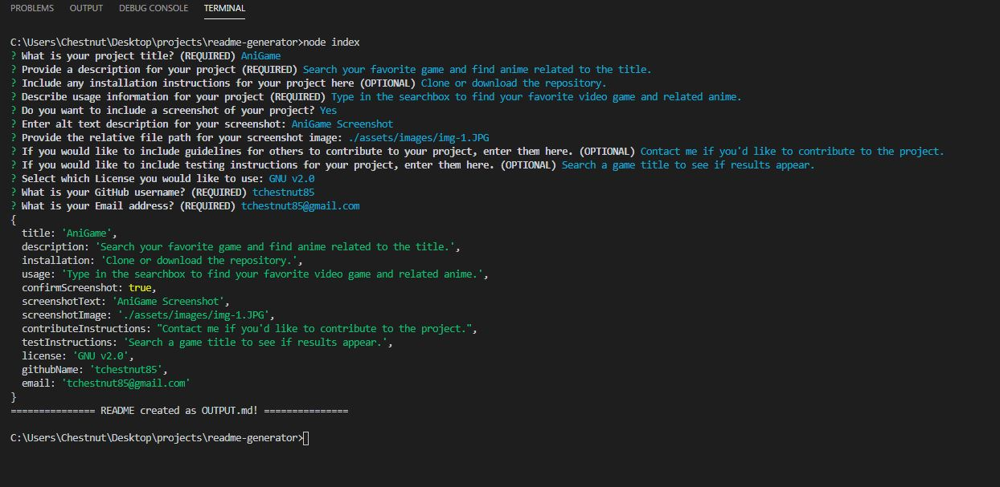

  # README Generator
  

  ## Description
  This is a README generator to create professional looking READMEs quickly. This app uses Node.js and Inquirer.js from NPM to prompt questions in the command line. A README will be generated as OUTPUT.md which should be copied over to the repo you are making the README for.

  

  ## Table of Contents
  * [Installation](#installation)
  * [Usage](#usage)
  * [Contributing](#contributing)
  * [Tests](#tests)
  * [Questions](#questions)
  * [License](#license)  

  ## Installation
  Make sure Node.js is installed on your computer. Clone or download the repository from GitHub. You may need to initialize Inquirer by running "npm install inquirer" 

  ## Usage
  This app can be used to create professional stlye README documents for any project you create. After completing the series of questions, you will have a new README file you can use for your project.

  ### Instructions 
  * The user will be prompted with a series of questions.
  * Based on the answers from the user, the various sections of the generated README will be filled in. The questions types used include answers with text input, yes/no confirmation and a list. 
  * Once all the questions have been answered, a confirmation will appear in the command line. 
  * A new README file named OUTPUT.md will be created with answers from the user populating the various section of the README.
  * This OUTPUT.md file should be copied into the repo you are making the README for and the name changed to README.md

  ## Contributing
  If you would like to contribute to this app, please contact me by email listed below.

  ## Questions
  Please visit my **[GitHub profile](https://github.com/tchestnut85/)** to check out this and other projects I've created and contributed to.
  If you have any specific questions about this project, please contact me at <tchestnut85@gmail.com>.

  ## License
  
  This app is licensed under the MIT license.
