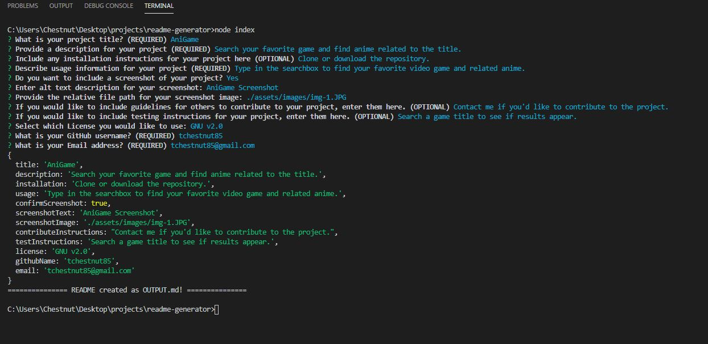

  # README Generator
  

  ## Description
  This is a README generator to create professional looking READMEs quickly. This app uses Node.js and Inquirer.js from NPM to prompt questions in the command line. A README will be generated as OUTPUT.md which should be copied over to the repo you are making the README for.

  #### README Generator Answers
  

  ## Table of Contents
  * [Installation](#installation)
  * [Usage](#usage)
  * [Contributing](#contributing)
  * [Questions](#questions)
  * [License](#license)  

  ## Installation
  - Make sure Node.js is installed on your computer. 
  - Clone or download the repository from GitHub. 
  - You may need to initialize Inquirer by running `npm install inquirer` in the terminal.

  ## Usage
  This app can be used to create professional stlye README documents for any project you create. After completing the series of questions, you will have a new README file you can use for your project.

  * You will be prompted with a series of questions to gather information for your project.
  * The question types used include text input, yes/no confirmation and a list. Type in text input answers, type Y or N then enter for confirmation answers, and use the up/down arrows for the list then enter to select the answer.
  * Once all the questions have been answered, your answers will print to the terminal and a confirmation will also appear in the terminal. 
  * A new README file named OUTPUT.md will be created with your answers populating the various sections of the README.
  * This OUTPUT.md file should be copied into the repo you are creating the README for and the name changed to README.md.

  ## Contributing
  If you would like to contribute to this app, please contact me by email listed below.

  ## Questions
  Please visit my **[GitHub profile](https://github.com/tchestnut85/)** to check out this and other projects I've created and contributed to.
  If you have any specific questions about this project, please contact me at <tchestnut85@gmail.com>.

  ## Links
  - **[Click here](https://github.com/tchestnut85/readme-generator/)** to visit this project's GitHub repo.
  - View a walkthrough video **[here](https://drive.google.com/file/d/1V5U9urFtRTVPT2B9ezQJArYRba-MC0RN/view?usp=sharing)**.
  - See a sample README generated from the app **[here](https://github.com/tchestnut85/readme-generator/blob/master/assets/READMEexample.md)**.

  ## License
  
  
  This app is licensed under the MIT license.
